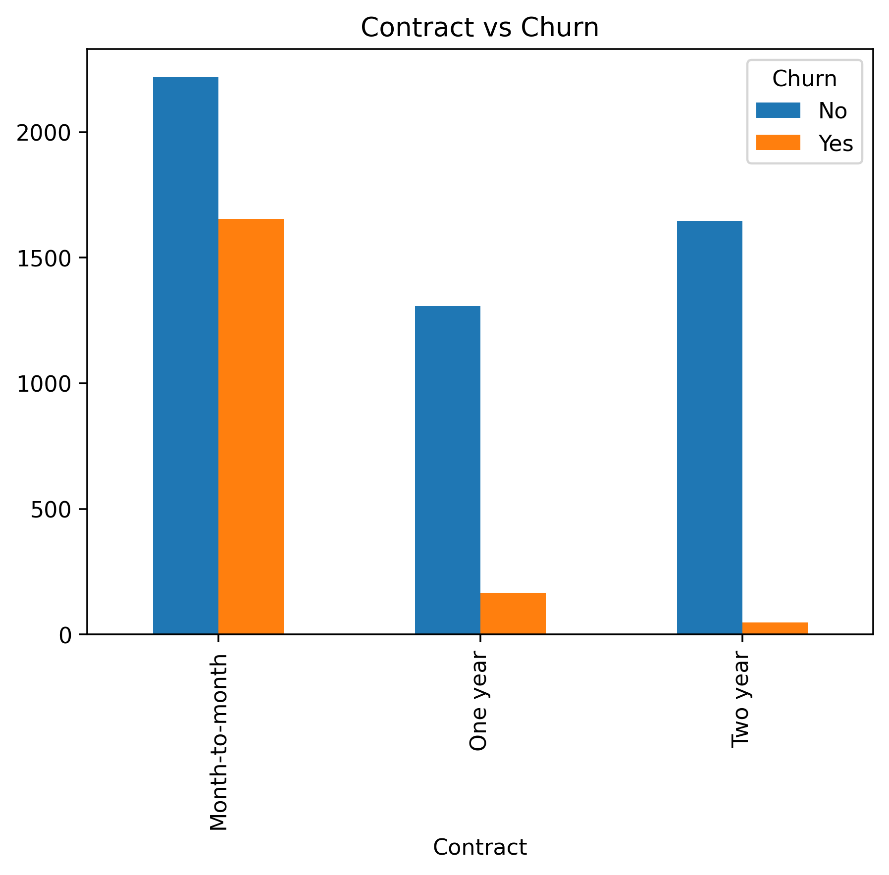
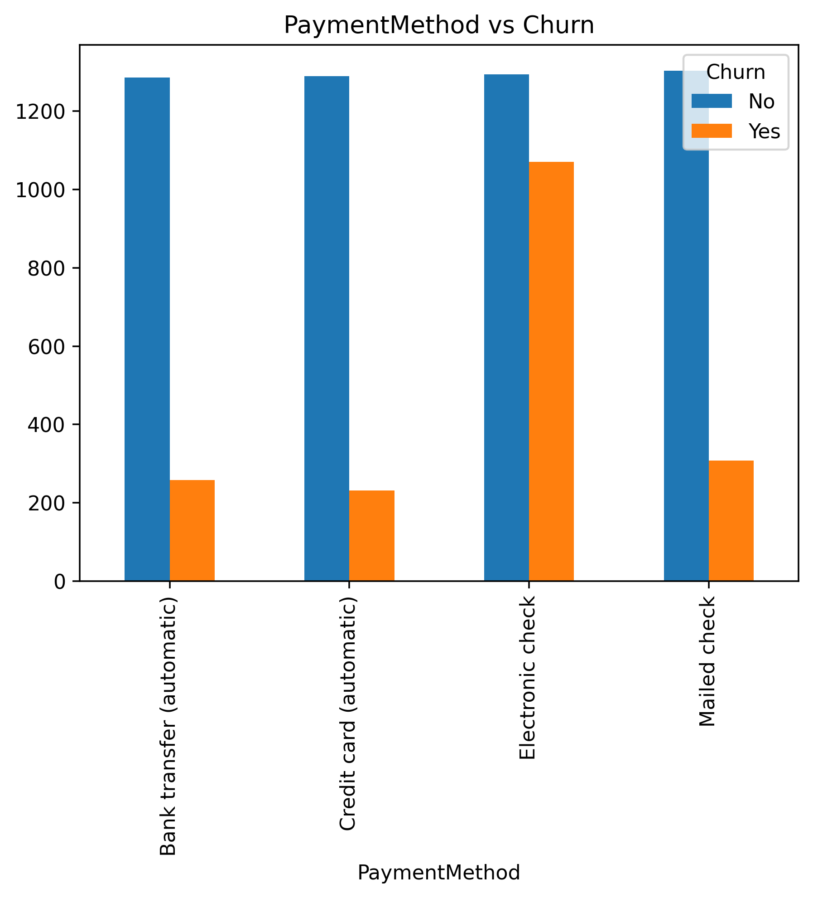
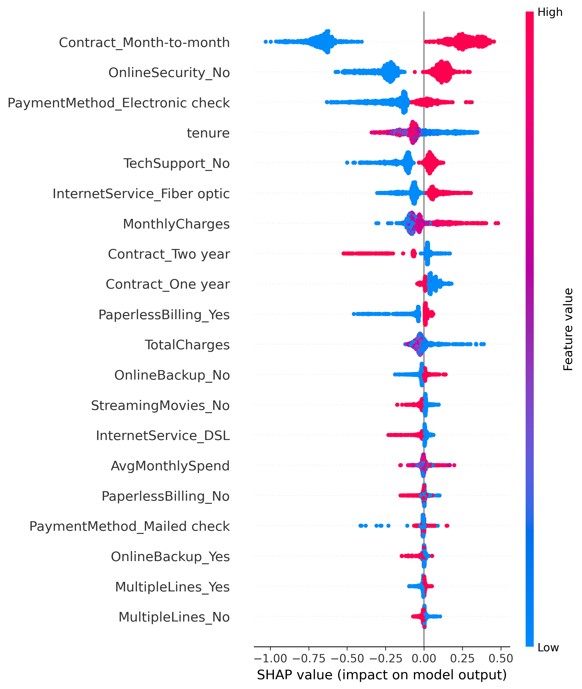
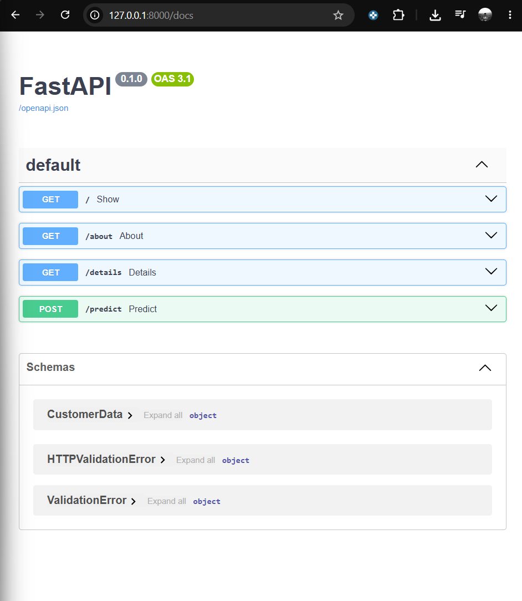
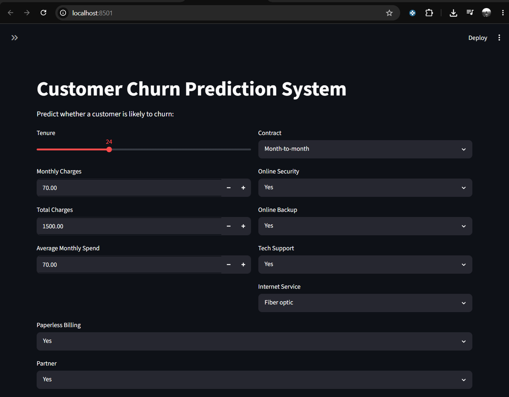
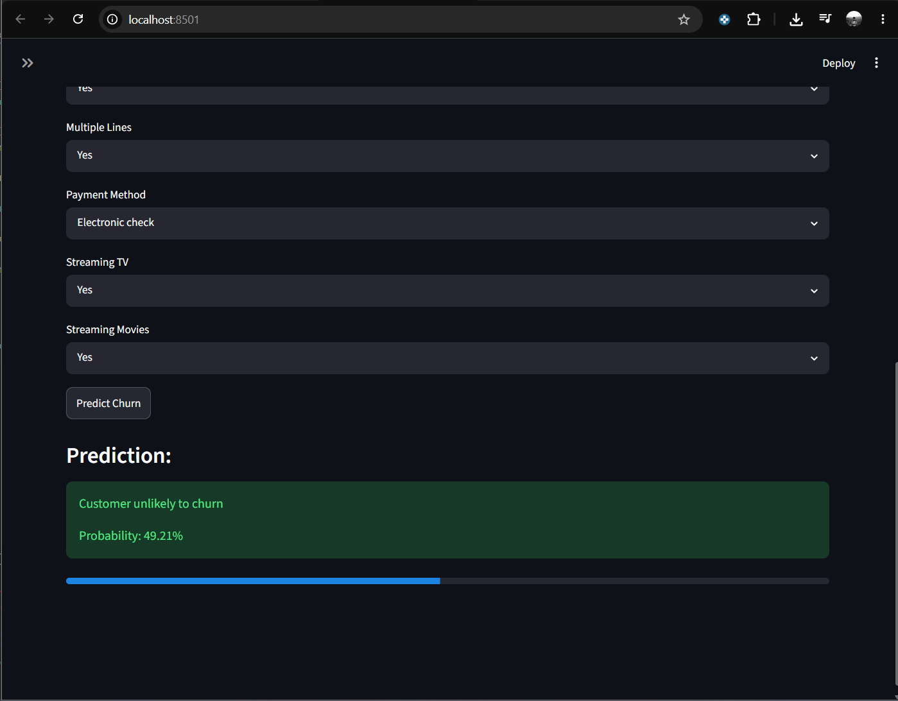

# Customer Churn Prediction System

An end-to-end Machine Learning project that predicts customer churn in the telecom industry using XGBoost. The project covers the complete ML workflow including exploratory data analysis, data preprocessing, feature engineering, model training, explainability using SHAP, and serving predictions through a FastAPI backend with a Streamlit frontend.

---

## Problem Statement

Customer churn is one of the biggest challenges faced by telecom companies. Identifying customers who are likely to leave enables businesses to take proactive retention measures, reducing customer loss and improving revenue.

This project builds a churn prediction system that estimates whether a customer is likely to churn based on customer demographics, subscription details, and billing information.

---

## Project Workflow

```
Data Collection
        │
        ▼
Exploratory Data Analysis
        │
        ▼
Data Preprocessing
        │
        ▼
Feature Engineering
        │
        ▼
Model Training
        │
        ▼
Hyperparameter Tuning
        │
        ▼
Model Evaluation
        │
        ▼
SHAP Explainability
        │
        ▼
FastAPI Backend
        │
        ▼
Streamlit Frontend
```

---

## Tech Stack

| Category | Tools |
|-----------|--------|
| Language | Python |
| Data Analysis | Pandas, NumPy |
| Visualization | Matplotlib, Seaborn |
| Machine Learning | Scikit-Learn, XGBoost |
| Imbalanced Data | SMOTE |
| Explainability | SHAP |
| Backend | FastAPI |
| Frontend | Streamlit |
| Version Control | Git, GitHub |

---

## Project Structure

```
Customer-Churn-Prediction/
│
├── app/
│   └── streamlit_app.py          # Streamlit frontend
│
├── backend/
│   ├── __init__.py
│   └── main.py                   # FastAPI backend
│
├── data/
│   └── preprocessed/
│
├── images/
│   ├── EDA/
│   └── Model Training/
│
├── models/
│   ├── churn_model.pkl
│   └── feature_columns.pkl
│
├── notebooks/
│   ├── churn_eda_preprocess.ipynb
│   └── model_training.ipynb
│
├── src/
│   └── predict.py
│
├── requirements.txt
└── README.md
```

---

# Exploratory Data Analysis

Several visualizations were created to understand customer behaviour and identify factors contributing to churn.

### Churn Distribution


### Tenure Distribution


### Total Charges Distribution


### Contract Type vs Churn



### Payment Method vs Churn



---

# Data Preprocessing

The preprocessing pipeline included:

- Handling missing values
- Converting `TotalCharges` to numeric
- Removing duplicate records
- One-hot encoding categorical features
- Feature engineering
- Handling class imbalance using SMOTE
- Train-Test Split

---

# Model Training

The following models were trained and evaluated:

- Logistic Regression
- Random Forest
- XGBoost

Hyperparameter tuning was performed using **GridSearchCV**, and **XGBoost** achieved the best overall performance.

---

# Model Evaluation

### Model Comparison (Bar Chart)


### ROC Curve


### Confusion Matrix


### Final Model Performance

| Metric | Score |
|--------|-------|
| Accuracy | 0.78 |
| Precision | 0.58 |
| Recall | 0.63 |
| F1 Score | 0.60 |
| ROC-AUC | 0.83 |

---

# Model Explainability

SHAP (SHapley Additive exPlanations) was used to understand how individual features influenced model predictions and to identify the most important features contributing to customer churn.

### SHAP Summary Plot



---

# Application Architecture

The application follows a modular architecture by separating the user interface from the prediction logic.

```
                User
                  │
                  ▼
          Streamlit Frontend
                  │
          HTTP POST Request
                  │
                  ▼
           FastAPI Backend
                  │
                  ▼
          predict_churn()
                  │
                  ▼
          XGBoost Model (.pkl)
                  │
                  ▼
     Prediction + Probability
                  │
                  ▼
          Streamlit Dashboard
```

---

# FastAPI Backend

The trained XGBoost model is served using FastAPI.

The API:

- Accepts customer information
- Loads the trained model
- Predicts customer churn
- Returns prediction and probability

### FastAPI Documentation



---

# Streamlit Frontend

An interactive Streamlit interface allows users to enter customer details and obtain churn predictions in real time.

### Input Page



### Prediction



---

# How to Run

### Clone the repository

```bash
git clone https://github.com/Vedid11/Customer-Churn-Prediction.git
cd Customer-Churn-Prediction
```

### Install dependencies

```bash
pip install -r requirements.txt
```

### Start FastAPI

```bash
cd backend
uvicorn main:app --reload
```

### Launch Streamlit

```bash
cd app
streamlit run streamlit_app.py
```

---

# Key Learnings

- Built an end-to-end machine learning workflow
- Performed exploratory data analysis and feature engineering
- Addressed class imbalance using SMOTE
- Compared multiple machine learning models
- Tuned XGBoost using GridSearchCV
- Evaluated models using Accuracy, Precision, Recall, F1 Score, and ROC-AUC
- Used SHAP for model interpretability
- Built a modular application using FastAPI and Streamlit
- Version controlled the project using Git and GitHub

---

# Future Improvements

- Build a preprocessing pipeline using `ColumnTransformer` and `Pipeline`
- Deploy the application to a cloud platform
- Add Docker support
- Automate model retraining
- Improve recall through threshold optimization

---


